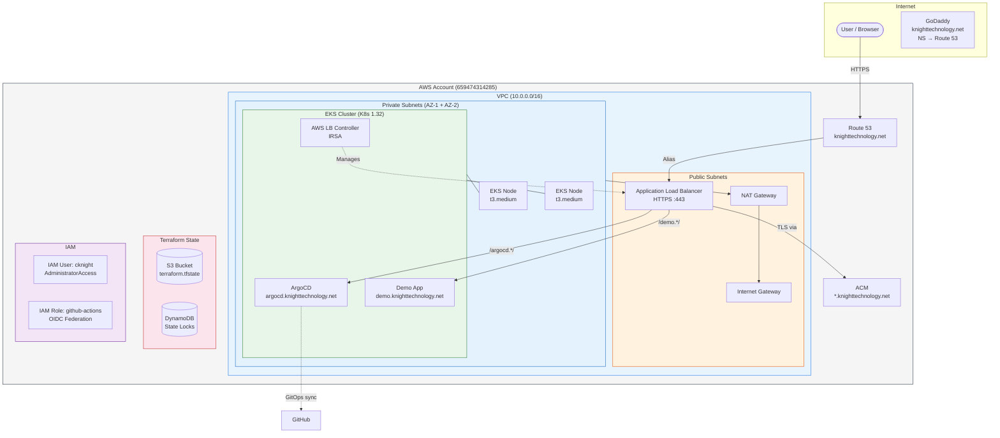
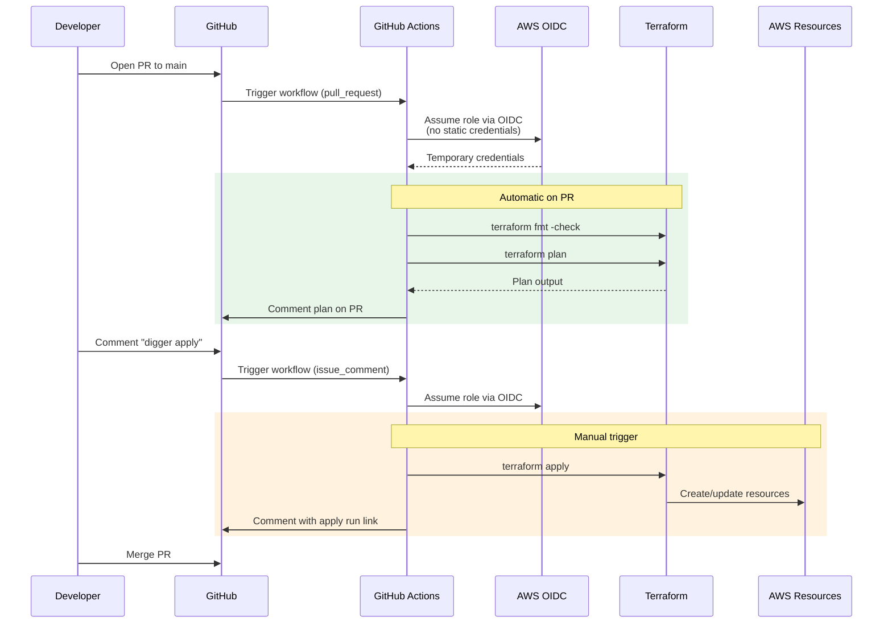
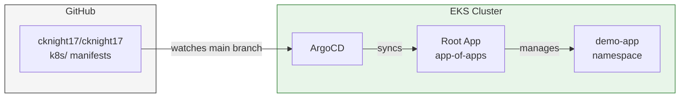

# cknight17 — AWS EKS Infrastructure

Production-style Kubernetes platform on AWS, managed with Terraform and ArgoCD.
Infrastructure changes deploy via **Digger** (Terraform CI/CD in GitHub Actions) using **OIDC** — no static AWS credentials.

## Architecture

### Infrastructure



### CI/CD Flow



### GitOps Application Delivery



**No static AWS credentials.** GitHub Actions authenticates via OIDC, assumes an IAM role, and gets temporary credentials. Digger orchestrates plan/apply with PR comments.

## Repository Structure

```
.
├── digger.yml              # Digger project config
├── .githooks/pre-commit    # Terraform fmt pre-commit hook
├── .github/workflows/
│   ├── digger.yml          # Digger plan/apply workflow
│   └── lint.yml            # Format & validate checks
├── terraform/
│   ├── bootstrap/          # S3 backend, DynamoDB locks, OIDC provider, IAM user, GH Actions role
│   ├── environments/dev/   # Dev environment root module
│   └── modules/
│       ├── vpc/            # VPC, subnets, NAT, IGW
│       ├── eks/            # EKS cluster + managed node groups + access entries
│       ├── argocd/         # ArgoCD Helm installation
│       ├── alb-controller/ # AWS Load Balancer Controller (Helm + IRSA)
│       ├── dns/            # Route 53, ACM wildcard cert, Ingress resources
│       ├── aurora/         # Aurora PostgreSQL (Phase 3)
│       ├── dynamodb/       # DynamoDB tables (Phase 3)
│       └── s3/             # S3 buckets (Phase 3)
├── k8s/
│   ├── argocd/             # ArgoCD app-of-apps config
│   └── apps/               # Application manifests
└── .github/workflows/      # CI/CD pipelines
```

## Quick Start

### Prerequisites
- AWS CLI configured with credentials for your AWS account
- Terraform >= 1.5
- kubectl

### 1. Bootstrap (one-time, from local machine)

This creates the S3 state bucket, lock tables, GitHub OIDC provider, and the IAM role for CI/CD.

```bash
cd terraform/bootstrap
terraform init
terraform apply
```

Save the `github_actions_role_arn` and `state_bucket` outputs — you'll need them next.

### 2. Initialize dev environment locally

```bash
cd terraform/environments/dev
# Create backend config with your account's state bucket
ACCOUNT_ID=$(aws sts get-caller-identity --query Account --output text)
echo "bucket = \"cknight17-terraform-state-${ACCOUNT_ID}\"" > backend.hcl
terraform init -backend-config=backend.hcl
```

### 3. Configure GitHub Secrets

Go to **Settings → Secrets and variables → Actions** in your GitHub repo:

| Secret Name    | Value                                                        |
|----------------|--------------------------------------------------------------|
| `AWS_ROLE_ARN` | The `github_actions_role_arn` output from the bootstrap step  |

### 4. Deploy via PR

```bash
git checkout -b initial-infra
git push -u origin initial-infra
# Open PR to main → Digger runs terraform plan automatically
# Review the plan comment on the PR
# Comment "digger apply" → infrastructure deploys
# Merge the PR
```

### 5. Connect to Cluster

```bash
aws eks update-kubeconfig --name cknight17-dev --region us-east-1
kubectl get nodes
```

### 6. Access ArgoCD

Get the admin password, then open https://argocd.knighttechnology.net:

```bash
kubectl -n argocd get secret argocd-initial-admin-secret -o jsonpath="{.data.password}" | base64 -d
# Open https://argocd.knighttechnology.net, user: admin
```

## Live URLs

| Service | URL |
|---------|-----|
| ArgoCD | https://argocd.knighttechnology.net |
| Demo App | https://demo.knighttechnology.net |

## Phases

| Phase | Description | Status |
|-------|-------------|--------|
| 1 | VPC + EKS + IAM/OIDC | ✅ Running |
| 2 | ArgoCD GitOps | ✅ Running |
| 2.5 | Digger CI/CD + OIDC auth | ✅ Running |
| 3 | DNS + HTTPS + ALB Ingress | ✅ Running |
| 4 | Aurora / DynamoDB / S3 | 📋 Scaffolded |
| 5 | Demo workloads | 📋 Scaffolded |

## Cost Estimate (Dev)
- EKS control plane: ~$73/mo
- 2x t3.medium nodes: ~$60/mo
- NAT Gateway: ~$32/mo
- ALB: ~$16/mo
- Route 53 hosted zone: ~$0.50/mo
- **Total: ~$181/mo** (can scale down to 1 node / ~$151/mo)

GPU spend is on top of this and only accrues while a GPU node is running — see below.

## GPU Workloads

The cluster runs CPU workloads on a fixed managed node group and provisions
GPU nodes on demand via **Karpenter**. Idle cost: ~$0 (no GPU nodes running).
Total spend is bounded by an AWS Budget alarm (default $100/mo, edit
`monthly_budget_usd` to change).

### Approximate GPU hourly cost (us-east-1)

| Instance     | vCPU | GPU      | VRAM  | Spot     | On-Demand |
|--------------|------|----------|-------|----------|-----------|
| g6.xlarge    | 4    | 1× L4    | 24 GB | ~$0.25/h | ~$0.81/h  |
| g6.2xlarge   | 8    | 1× L4    | 24 GB | ~$0.30/h | ~$0.97/h  |
| g5.xlarge    | 4    | 1× A10G  | 24 GB | ~$0.30/h | ~$1.00/h  |
| g5.2xlarge   | 8    | 1× A10G  | 24 GB | ~$0.35/h | ~$1.21/h  |

Spot prices fluctuate; these are typical numbers. Karpenter prefers spot and
falls through to on-demand only if spot capacity isn't available in the AZ.

### Scheduling onto a GPU node

GPU nodes are tainted `nvidia.com/gpu=true:NoSchedule` so regular workloads
don't land on them. A training pod needs the matching toleration, the
`workload: gpu-ml` node selector, and a `nvidia.com/gpu` resource request:

```yaml
apiVersion: batch/v1
kind: Job
metadata:
  name: trainer
  namespace: cameron
spec:
  template:
    spec:
      restartPolicy: Never
      tolerations:
        - key: nvidia.com/gpu
          operator: Equal
          value: "true"
          effect: NoSchedule
      nodeSelector:
        workload: gpu-ml
      containers:
        - name: trainer
          image: <your image>
          resources:
            limits:
              nvidia.com/gpu: 1
```

When the pod is unschedulable, Karpenter provisions a `g6.xlarge` or
`g5.xlarge` (xlarge or 2xlarge) within ~45 seconds. When the pod finishes
and the node sits empty for 30 seconds, Karpenter terminates it.

### Guardrails

- **NodePool CPU limit:** 32 vCPU total → at most ~4 single-GPU nodes
  concurrently.
- **AWS Budget:** alerts at 50% forecasted / 80% actual / 100% actual against
  the monthly cap.
- **`cameron` namespace ResourceQuota:** 2 GPUs, 16 vCPU, 64 Gi memory.
